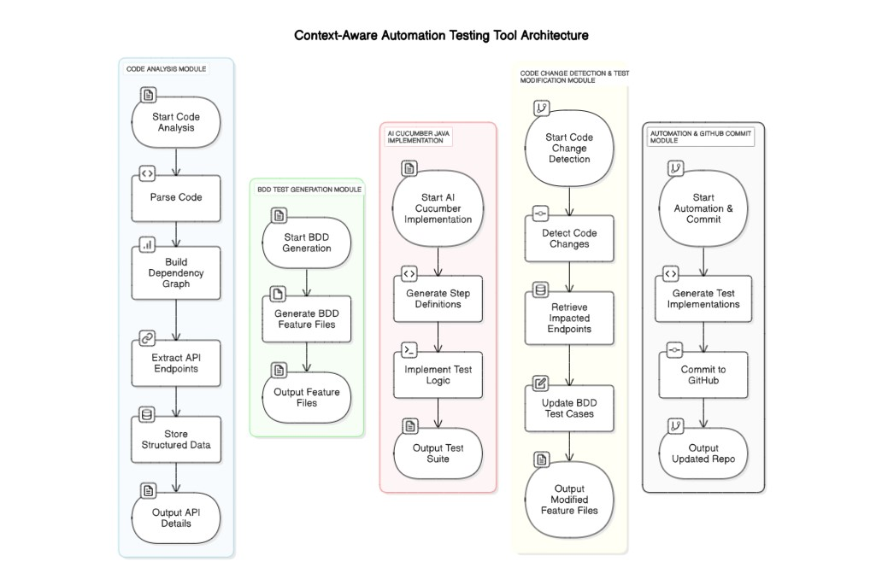

**Context-Aware Automation Testing Tool**

### **1. Code Analysis Module**
- **Input:** Source code from repositories
- **Process:**
  - AI-based code parsing
  - Build dependency graph (Neo4j)
  - Extract API endpoints (Swagger-like extraction)
- **Output:**
  - Structured data stored in chromaDB for RAG
  - API details (name, method, parameters, response)

### **2. BDD Test Generation Module**
- **Input:** Extracted API details & business logic from chromaDB
- **Process:**
  - Fine-tuned Gemini 1.5 Flash model generates BDD feature files
- **Output:**
  - Auto-generated feature files for testing

### **3. AI Cucumber Java Implementation**
- **Input:** Generated BDD feature files
- **Process:**
  - OpenHands Software Engineering Assistant generates step definitions
  - Implements test automation logic
- **Output:**
  - Complete test automation suite

### **4. Code Change Detection & Test Modification Module**
- **Input:** Code changes detected via GitHub SaaS service
- **Process:**
  - Retrieve impacted endpoints from ChromeDB
  - AI model updates BDD test cases based on changes
- **Output:**
  - Modified feature files reflecting code updates

### **5. Automation & GitHub Commit Module**
- **Input:** Updated BDD feature files
- **Process:**
  - OpenHands AI generates test implementations
  - Automated commit to GitHub repository
- **Output:**
  - Updated automation repo with new/modified tests

### **Technologies & Tools Used:**
- **AI Models:** Fine-tuned Gemini 1.5 Flash for BDD generation
- **Databases:** Neo4j (Dependency Graph), ChromeDB (RAG Storage)
- **Testing Framework:** Cucumber (Java-based BDD Testing)
- **Automation Tools:** OpenHands Software Engineering Assistant
- **Version Control & CI/CD:** GitHub SaaS Services

### **Workflow Summary:**
1. **Extract Code & Build Dependency Graph** → Store API details in chromaDB
2. **Generate BDD Feature Files** using AI model
3. **Implement Tests** via OpenHands AI
4. **Detect Code Changes** via GitHub SaaS → Retrieve impacted endpoints
5. **Modify BDD Tests** using AI with context from chromaDB
6. **Commit Updated Test Cases & Implementations** automatically

This diagram provides a structured view of how various modules interact to automate functional testing using AI-driven methodologies.

